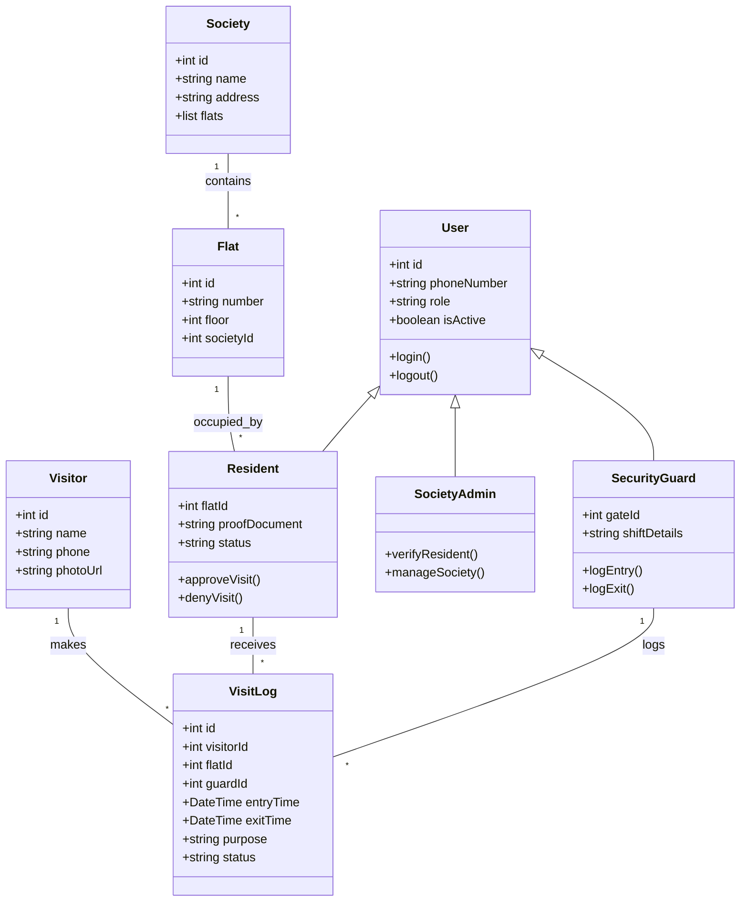

# Class Diagram

```mermaid
classDiagram
    class User {
        +int id
        +string phoneNumber
        +string role
        +boolean isActive
        +login()
        +logout()
    }

    class Resident {
        +int flatId
        +string proofDocument
        +string status
        +approveVisit()
        +denyVisit()
    }

    class SecurityGuard {
        +int gateId
        +string shiftDetails
        +logEntry()
        +logExit()
    }

    class SocietyAdmin {
        +verifyResident()
        +manageSociety()
    }

    class Society {
        +int id
        +string name
        +string address
        +list<Flat> flats
    }

    class Flat {
        +int id
        +string number
        +int floor
        +int societyId
    }

    class Visitor {
        +int id
        +string name
        +string phone
        +string photoUrl
    }

    class VisitLog {
        +int id
        +int visitorId
        +int flatId
        +int guardId
        +DateTime entryTime
        +DateTime exitTime
        +string purpose
        +string status
    }

    User <|-- Resident
    User <|-- SecurityGuard
    User <|-- SocietyAdmin

    Society "1" -- "*" Flat : contains
    Flat "1" -- "*" Resident : occupied_by
    
    SecurityGuard "1" -- "*" VisitLog : logs
    Resident "1" -- "*" VisitLog : receives
    Visitor "1" -- "*" VisitLog : makes
```
